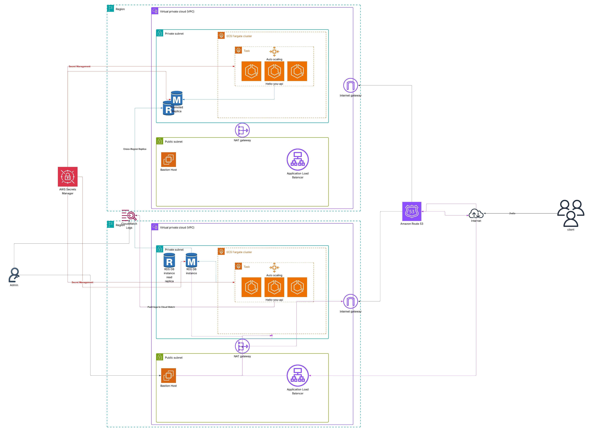

# Cross-Region Disaster Recovery Runbook

## Overview
This runbook covers complete regional failover for the ECS Fargate application with PostgreSQL RDS using cross-region read replicas and Route53 for traffic management.

## Architecture Design

### Primary Region (us-east-1)


### Route53 Health Checks & Failover
- **Primary**: Weighted routing (100%) to us-east-1 ALB
- **Secondary**: Failover routing (0%) to us-west-2 ALB
- **Health Check**: Monitor primary ALB endpoint every 30 seconds
- **TTL**: 60 seconds for fast DNS propagation

## Deployment Strategy

### Phase 1: Deploy Secondary Region Infrastructure

#### Step 1: Prepare Terraform for Multi-Region
Create a new directory structure:
```
├── environments/
│   ├── primary/          # us-east-1
│   │   ├── main.tf
│   │   ├── terraform.tfvars
│   │   └── backend.tf
│   └── secondary/        # us-west-2
│       ├── main.tf
│       ├── terraform.tfvars
│       └── backend.tf
├── modules/
│   ├── networking/
│   ├── ecs-fargate/
│   ├── rds/
│   └── route53/
```

#### Step 2: Secondary Region Terraform Configuration
```hcl
# environments/secondary/terraform.tfvars
aws_region = "us-west-2"
environment = "prod-dr"
app_name = "your-app"

# DR-specific settings
desired_count = 0          # Start with 0 tasks (standby)
min_capacity = 0           # Standby mode
max_capacity = 10          # Higher capacity for emergency load

# Use cross-region replica
enable_cross_region_replica = true
primary_region = "us-east-1"
primary_db_identifier = "your-app-prod-db"
```

#### Step 3: Deploy Secondary Infrastructure
```bash
cd environments/secondary
terraform init
terraform plan
terraform apply

# Verify deployment
aws ecs list-clusters --region us-west-2
aws rds describe-db-instances --region us-west-2
```

### Phase 2: Configure Cross-Region RDS Replica

#### Step 4: Create Cross-Region Read Replica
```bash
# From primary region, create cross-region replica
aws rds create-db-instance-read-replica \
  --db-instance-identifier your-app-prod-db-replica-west \
  --source-db-instance-identifier arn:aws:rds:us-east-1:ACCOUNT:db:your-app-prod-db \
  --db-instance-class db.t3.small \
  --region us-west-2 \
  --storage-encrypted \
  --vpc-security-group-ids sg-xxxxxxxxx
```

### Phase 3: Route53 Configuration

#### Step 5: Setup DNS Failover
```hcl
# Primary Record (Weighted)
resource "aws_route53_record" "primary" {
  zone_id = aws_route53_zone.main.zone_id
  name    = "api.yourdomain.com"
  type    = "A"
  
  set_identifier = "primary"
  
  weighted_routing_policy {
    weight = 100
  }
  
  health_check_id = aws_route53_health_check.primary.id
  
  alias {
    name                   = aws_lb.primary.dns_name
    zone_id               = aws_lb.primary.zone_id
    evaluate_target_health = true
  }
}

# Failover Record
resource "aws_route53_record" "failover" {
  zone_id = aws_route53_zone.main.zone_id
  name    = "api.yourdomain.com"
  type    = "A"
  
  set_identifier = "failover"
  
  failover_routing_policy {
    type = "SECONDARY"
  }
  
  alias {
    name                   = aws_lb.secondary.dns_name
    zone_id               = aws_lb.secondary.zone_id
    evaluate_target_health = true
  }
}
```

## Disaster Recovery Procedures

### Scenario 1: Complete Regional Failure (us-east-1)

#### Detection (5-10 minutes)
- Route53 health checks fail
- CloudWatch alarms trigger
- Application becomes unreachable

#### Automatic Failover (2-5 minutes)
1. **DNS Failover**: Route53 automatically routes to us-west-2
2. **Traffic Routing**: New requests go to secondary region

#### Manual Intervention Required (10-20 minutes)
```bash
# 1. Promote cross-region replica to master
aws rds promote-read-replica \
  --db-instance-identifier your-app-prod-db-replica-west \
  --region us-west-2

# 2. Scale up ECS service in secondary region
aws ecs update-service \
  --cluster your-app-prod-dr \
  --service your-app-prod-dr \
  --desired-count 3 \
  --region us-west-2

# 3. Update auto-scaling minimum
aws application-autoscaling put-scaling-policy \
  --policy-name your-app-prod-dr-cpu-scaling \
  --service-namespace ecs \
  --resource-id service/your-app-prod-dr/your-app-prod-dr \
  --scalable-dimension ecs:service:DesiredCount \
  --region us-west-2

# 4. Verify application health
curl https://api.yourdomain.com/health
```

### Scenario 2: Planned Regional Maintenance

#### Pre-Maintenance (24-48 hours before)
```bash
# 1. Pre-warm secondary region
aws ecs update-service \
  --cluster your-app-prod-dr \
  --service your-app-prod-dr \
  --desired-count 1 \
  --region us-west-2

# 2. Update Route53 weights for gradual traffic shift
# Primary: 90%, Secondary: 10%
```

#### During Maintenance
```bash
# 1. Shift all traffic to secondary
# Primary: 0%, Secondary: 100%

# 2. Scale down primary region
aws ecs update-service \
  --cluster your-app-prod \
  --service your-app-prod \
  --desired-count 0 \
  --region us-east-1
```

#### Post-Maintenance
```bash
# 1. Restore primary region
# 2. Gradually shift traffic back
# 3. Scale down secondary to standby mode
```

## Cross-Region Terraform Configuration

### Primary Region Module
```hcl
# environments/primary/main.tf
module "primary_infrastructure" {
  source = "../../modules"
  
  aws_region = "us-east-1"
  environment = "prod"
  
  # Enable cross-region replication
  enable_cross_region_replica = true
  replica_region = "us-west-2"
  
  # Route53 configuration
  enable_route53_failover = true
  primary_region = true
}
```

### Secondary Region Module
```hcl
# environments/secondary/main.tf
module "secondary_infrastructure" {
  source = "../../modules"
  
  aws_region = "us-west-2"
  environment = "prod-dr"
  
  # Standby configuration
  desired_count = 0
  min_capacity = 0
  max_capacity = 10
  
  # Cross-region replica
  enable_cross_region_replica = true
  primary_region = false
  
  # Route53 configuration
  enable_route53_failover = true
  primary_region = false
}
```

## Recovery Time Objectives (RTO)

| Scenario | Detection | DNS Failover | App Recovery | Total RTO |
|----------|-----------|--------------|--------------|-----------|
| Auto Failover | 2-5 min | 1-2 min | 10-15 min | **15-22 min** |
| Manual Failover | 0 min | 1-2 min | 5-10 min | **6-12 min** |
| Planned Maintenance | N/A | <1 min | <1 min | **<2 min** |

## Recovery Point Objectives (RPO)

| Component | RPO | Notes |
|-----------|-----|-------|
| Database | <5 min | Cross-region replica lag |
| Application State | 0 | Stateless application |
| Container Images | 0 | Stored in ECR, multi-region |
| Configuration | 0 | Infrastructure as Code |

## Testing & Validation

### Monthly DR Drill
```bash
#!/bin/bash
# dr-test.sh

echo "Starting DR test..."

# 1. Update Route53 to point to DR region
aws route53 change-resource-record-sets --hosted-zone-id Z123456789 \
  --change-batch file://failover-change-batch.json

# 2. Scale up DR region
aws ecs update-service --cluster your-app-prod-dr \
  --service your-app-prod-dr --desired-count 3 --region us-west-2

# 3. Test application functionality
curl -f https://api.yourdomain.com/health || exit 1
curl -f https://api.yourdomain.com/api/test || exit 1

# 4. Check database connectivity
psql $DR_DATABASE_URL -c "SELECT 1;" || exit 1

echo "DR test successful!"

# 5. Restore to primary (optional)
# aws route53 change-resource-record-sets --hosted-zone-id Z123456789 \
#   --change-batch file://restore-change-batch.json
```

### Validation Checklist
- [ ] Cross-region replica lag < 5 minutes
- [ ] Route53 health checks functional
- [ ] Secondary region ECS service can scale
- [ ] Application connects to promoted replica
- [ ] SSL certificates valid in both regions
- [ ] CloudWatch alarms configured in both regions
- [ ] VPC peering/transit gateway if needed for shared resources

## Cost Optimization

### Standby Mode Costs
- **ECS**: $0 (0 running tasks)
- **ALB**: ~$18/month (always running)
- **RDS Replica**: ~$15-50/month (depending on instance size)
- **VPC/Networking**: ~$5/month
- **Route53**: ~$1/month

**Total DR Cost**: ~$40-75/month

### During Failover
- Costs increase temporarily as both regions run simultaneously
- Primary region should be scaled down ASAP to minimize costs

## Emergency Contacts & Escalation

1. **Level 1**: DevOps Engineer (immediate response)
2. **Level 2**: Platform Engineering Lead (< 30 minutes)
3. **Level 3**: CTO/VP Engineering (critical incidents)

## Post-Incident Actions

1. **Incident Review**: Within 24 hours
2. **Root Cause Analysis**: Within 72 hours
3. **Runbook Updates**: Based on lessons learned
4. **Process Improvements**: Quarterly review
5. **DR Testing**: Increase frequency if issues found

## Automation Opportunities

### Phase 1 (Manual)
- Manual promotion of read replica
- Manual ECS scaling
- Manual Route53 updates

### Phase 2 (Semi-Automated)
- Lambda functions for common tasks
- CloudWatch Events for auto-scaling
- Ansible playbooks for complex workflows

### Phase 3 (Fully Automated)
- Complete automated failover
- Health-check driven decisions
- Automatic rollback capabilities